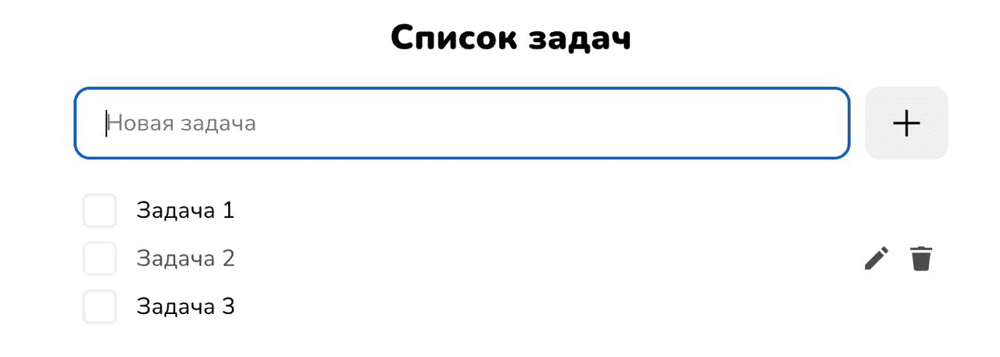

# ToDo Planner
________
Приложение, позволяющее планировать список дел.

## Возможности
___
- [x] Добавление задачи
- [x] Возможность вычеркнуть задачу (отметить как сделанную)
- [x] Возможность удалить выполненную задачу
- [ ] Адаптивная вёрстка
- [ ] Хранение задач в localStorage
- [ ] Фильтр задач
- [ ] Редактирование задачи
- [ ] Тестирование

## Стек
___
* Vanilla JS
* BEM

## Статус разработки
___

В разработке